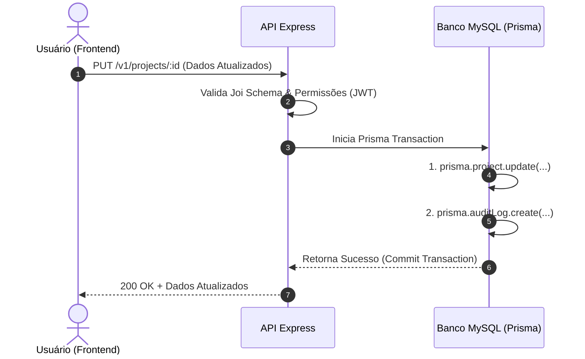

# 📄 Especificação Técnica: Edição de Entidades e Trilha de Auditoria

## 🎯 Objetivo

Implementar a funcionalidade completa de edição (Update) para **Projetos** e **Incidentes** na plataforma, em conjunto com um sistema de auditoria que rastreie o histórico de alterações (quem editou e quando a edição ocorreu).

---

## 🛠️ Escopo das Alterações

### 1. Banco de Dados (Prisma)

Para rastrear quem fez a alteração e quando, precisaremos criar uma nova tabela de registro de auditoria, já que o `updatedAt` nativo apenas diz *quando* a última alteração ocorreu, mas não *quem* a fez ou o histórico.

**Ação requerida no `schema.prisma`:**
Adicionar o model `AuditLog` e rodar a migração.

```prisma
model AuditLog {
  id          String   @id @default(uuid())
  entityType  String   @db.VarChar(50) // Ex: "Project" ou "Incident"
  entityId    String
  action      String   @default("UPDATE") @db.VarChar(20)
  userId      String
  user        User     @relation(fields: [userId], references: [id], onDelete: Cascade)
  createdAt   DateTime @default(now())
  
  // Opcional: Para guardar o que mudou (JSON com dados antigos/novos)
  // details     Json?    
}

```

*Lembre-se de adicionar a relação `auditLogs AuditLog[]` no model `User`.*

### 2. Backend (API Node.js)

As rotas de edição `PUT /v1/projects/:id` e `PUT /v1/incidents/:id` já existem nos *controllers*, mas os *services* correspondentes precisam ser atualizados.

**Ação requerida:**
No `project.service.ts` e no `incident.service.ts`, envolver o método de `update` em uma transação do Prisma (`prisma.$transaction`) para garantir que a entidade só seja atualizada se o log de auditoria também for salvo com sucesso.

**Exemplo de fluxo esperado:**

1. Valida permissões (já existente).
2. Atualiza a entidade (Project/Incident).
3. Cria o registro na tabela `AuditLog` passando o `userId` (disponível no `req.user.userId`), o `entityId` alterado, e o `entityType`.
4. Retorna a entidade atualizada.

### 3. Frontend (Next.js)

Consumir as rotas de edição e exibir o histórico.

**Ação requerida:**

* **Interface de Edição:** Criar os modais ou páginas de edição consumindo o endpoint `PUT`.
* **Interface de Histórico:** Na página de detalhes do Projeto/Incidente, adicionar uma seção de "Histórico de Alterações" consumindo os dados de auditoria para exibir: *"Alterado por [Nome do Analista] em [Data e Hora]"*.

---

## 📐 Fluxo da Arquitetura (Sequence Diagram)

Abaixo está o fluxo esperado para a operação de edição com a integração da trilha de auditoria:



---

## 🌿 Git Workflow & Regras de Versionamento

Para garantir a integridade do repositório, siga rigorosamente o fluxo de branch estabelecido para esta task:

1. **Atualize sua base:** Certifique-se de estar com a branch `dev` atualizada na sua máquina (`git pull origin dev`).
2. **Criação da Branch:** A partir da `dev`, crie uma nova branch seguindo o padrão de nomenclatura `feat/`:
```bash
git checkout -b feat/implementacao-auditoria-edicao

```


3. **Desenvolvimento:** Realize os commits de forma atômica e descritiva (ex: `feat: adiciona model AuditLog no prisma`, `feat: implementa interface de edicao no front`).
4. **Finalização:** Ao concluir as validações locais, suba a branch para o repositório remoto:
```bash
git push origin feat/implementacao-auditoria-edicao

```


5. **Integração:** Abra um **Merge Request (MR) / Pull Request (PR)** apontando **obrigatoriamente para a branch `dev**` e solicite a revisão de código. Não realize o merge diretamente.